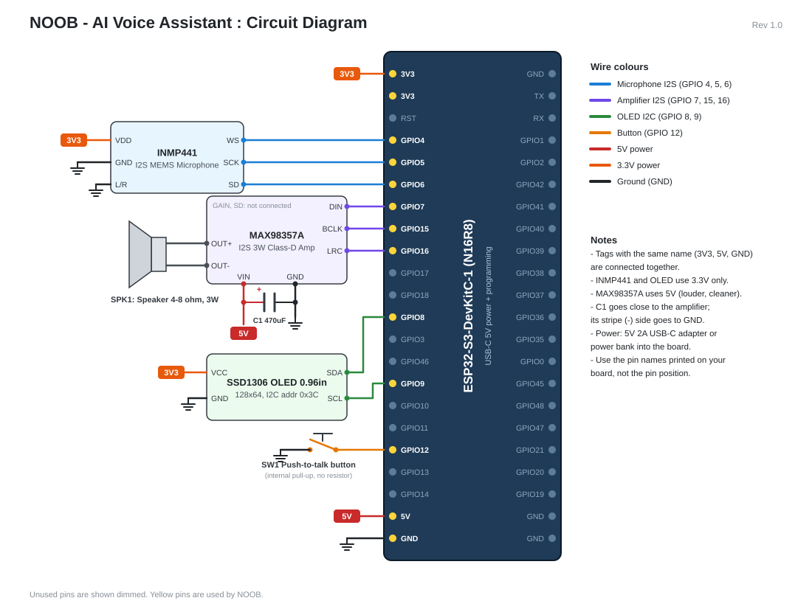

# NOOB — Your Multilingual AI Friend with Healthcare Knowledge

NOOB is a voice assistant, like Alexa, built on an **ESP32-S3** microcontroller with a companion **NOOB App**.
Talk to it in **any language** and it answers out loud in the same language with a natural **female voice**.
NOOB remembers what you tell it — even after it is switched off — and is specially instructed for
**healthcare**: symptoms, first aid, medicines, nutrition, mental well-being, and when to see a doctor.

**Everything NOOB uses is free.** The only cost is the electronic components.



---

## 1. Features

| Feature | How it works |
|---|---|
| Talk by voice — on the NOOB device **or** in the NOOB App | Hold the button on NOOB, or tap the orb in the app |
| Conversation mode | The app keeps listening after each answer, like chatting with a friend |
| Understands 99 languages (Hindi, English, Tamil, Bengali, Marathi, Gujarati, ...) | Whisper speech recognition with automatic language detection |
| Replies in the same language, female voice (70+ languages) | Microsoft Edge neural voices |
| General knowledge, today's date & time, live news / weather / scores | Google Gemini (free tier) + PC clock + free DuckDuckGo web search |
| Works offline too | Automatic backup to a local AI (Ollama + Gemma 3) |
| Healthcare knowledge with safety rules | Emergencies → 112 / 108, Tele MANAS 14416, no false diagnoses |
| **Permanent memory** | Everything NOOB learns is saved in a local database and survives power-off |
| **NOOB App**: About Me, Memory, Conversations, Devices, Settings | Web app (HTML + CSS + JavaScript) served by the NOOB server |
| **Connect to nearby devices** | The app finds NOOB devices on your Wi-Fi and pairs with a 4-digit code on NOOB's screen |
| Status screen | 0.96" OLED: Ready / Listening / Thinking / Speaking / pairing code |

### Languages used to build NOOB

| Part | Language |
|---|---|
| NOOB device firmware | **C++** (Arduino) |
| NOOB server (speech, AI, memory, devices) | **Python** |
| NOOB App (user interface) | **HTML, CSS, JavaScript** |
| Memory database | **SQL** (SQLite) |

---

## 2. How it works

```
 ┌──────────── NOOB device ────────────┐        ┌──────────────────── NOOB server (your PC) ────────────────────┐
 │ INMP441 mic ─I2S─►                  │ Wi-Fi  │ 1. Whisper      speech ──► text + language                    │
 │                  ESP32-S3 ─────────────────────►2. Gemini AI   question ──► answer (+ date/time, web search)  │
 │ MAX98357A ◄─I2S─  (PSRAM) ◄─────────────────────3. Edge TTS    answer ──► female voice                        │
 │  └► speaker                         │ audio  │                                                               │
 │ OLED ◄─I2C─   Button ─►             │        │ Memory database (noob_memory.db)  ◄──►  NOOB App (browser)    │
 └─────────────────────────────────────┘        └───────────────────────────────────────────────────────────────┘
```

1. **Record** – While the button is held, the ESP32-S3 reads the INMP441 digital microphone over I2S
   at 16,000 samples per second and stores up to 10 seconds of audio in PSRAM.
   (In the app, your PC's microphone is used and NOOB stops listening when you stop talking.)
2. **Send** – The audio is sent over Wi-Fi to the NOOB server on your PC.
3. **Understand** – Whisper converts speech to text and detects the language.
4. **Think** – The text goes to the AI with NOOB's friendly personality, healthcare safety rules, your
   About Me details, everything NOOB remembers, the last few messages, and today's date and time.
   If the AI needs live information it asks for a web search (`SEARCH:`), and it saves or deletes memories
   with `REMEMBER:` / `FORGET:` lines (never spoken).
5. **Speak** – The answer becomes speech with a female voice for that language and is streamed back.
6. **Play** – The ESP32-S3 streams the audio to the MAX98357A amplifier over I2S and the speaker plays it.

**Why a server?** An ESP32 has 8 MB of memory; a modern AI model needs many gigabytes. So the ESP32
handles the hardware and the heavy AI runs on the PC and in the cloud — the same design used by
commercial smart speakers.

| Part | Service | Cost |
|---|---|---|
| Speech → text | Whisper (runs on the PC) | Free |
| AI brain | Google Gemini API free tier (`gemini-3.8-flash`) | Free (daily limit, plenty for personal use) |
| Backup AI brain | Ollama + Gemma 3 4B (runs on the PC, offline) | Free |
| Female voice | Microsoft Edge neural voices | Free |
| Live web search | DuckDuckGo (no account needed) | Free |
| Memory | SQLite database on the PC | Free |

---

## 3. Components (Bill of Materials)

| # | Component | Qty | Purpose | Approx. price (INR) |
|---|---|---|---|---|
| 1 | **ESP32-S3-DevKitC-1 N16R8** (16 MB flash, 8 MB PSRAM) | 1 | Brain of the device, Wi-Fi | 650 – 900 |
| 2 | **INMP441** I2S MEMS microphone module | 1 | Digital microphone | 200 – 250 |
| 3 | **MAX98357A** I2S 3 W class-D amplifier module | 1 | Drives the speaker | 250 – 350 |
| 4 | Speaker **4 Ω or 8 Ω, 3 W** (40–50 mm) | 1 | Voice output | 80 – 150 |
| 5 | **SSD1306 0.96" OLED**, 128×64, **I2C, 4-pin** | 1 | Status display + pairing code | 200 – 250 |
| 6 | Tactile push button (6 mm or 12 mm) | 1 | Push-to-talk | 10 |
| 7 | 470 µF – 1000 µF, 10 V (or higher) electrolytic capacitor | 1 | Stops voltage dips when the speaker is loud | 10 |
| 8 | 830-point breadboard | 2 | The ESP32-S3 board is wide — place it across two | 160 |
| 9 | Jumper wires (male-to-male) | 30 | Connections | 100 |
| 10 | USB-C **data** cable | 1 | Programming + power | 100 |
| 11 | 5 V / 2 A USB charger or power bank | 1 | Power | — |

Approximate total: **₹2,000 – 2,500**. Tools: soldering iron + solder (the mic and amplifier modules usually
come with loose header pins that must be soldered).

> **Buying tips.** The ESP32 board **must say N16R8 or N8R8** (the "R8" = 8 MB PSRAM, needed to hold the recording).
> Buy the **I2C** OLED (4 pins: GND, VCC, SCL, SDA), not the 7-pin SPI version.

---

## 4. Wiring

| From module | Module pin | ESP32-S3 pin | Wire colour in diagram |
|---|---|---|---|
| INMP441 microphone | VDD | **3V3** | orange |
| | GND | GND | black |
| | L/R | GND (selects left channel) | black |
| | WS | **GPIO 4** | blue |
| | SCK | **GPIO 5** | blue |
| | SD | **GPIO 6** | blue |
| MAX98357A amplifier | VIN | **5V** | red |
| | GND | GND | black |
| | DIN | **GPIO 7** | purple |
| | BCLK | **GPIO 15** | purple |
| | LRC | **GPIO 16** | purple |
| | GAIN, SD | not connected | — |
| | + / − (speaker terminals) | Speaker wires | grey |
| C1 470 µF capacitor | + (long leg) → amplifier VIN, − (striped side) → GND | | |
| SSD1306 OLED | VCC | **3V3** | orange |
| | GND | GND | black |
| | SDA | **GPIO 8** | green |
| | SCL | **GPIO 9** | green |
| Push button | one leg | **GPIO 12** | yellow-orange |
| | other leg | GND | black |

**Safety checks before powering on**

- The INMP441 and the OLED are **3.3 V parts** — never connect them to 5V.
- The capacitor is polarised: the stripe side goes to **GND**.
- Use the pin **names printed on your board** (e.g. "5", "15", "5V"), not the position — some clone boards shift pins.
- All GND pins are connected together.

The full diagram is in [`docs/circuit_diagram.svg`](docs/circuit_diagram.svg) (open it in any web browser).

---

## 5. Setup

### 5.1 NOOB server + NOOB App (on your Windows PC)

1. Install **Python 3.12 or newer** from python.org (tick *"Add Python to PATH"*). Tested with Python 3.14.
2. Open a terminal in the `server` folder and install the libraries:
   ```bash
   pip install -r requirements.txt
   ```
3. Double-click **`server/NOOB App.bat`**.
   It starts the NOOB server in the background and opens the NOOB App in its own window.
   The first start downloads the speech model (~480 MB), so it takes a few minutes once.
   Allow Python through the Windows firewall (*Private networks*) and allow the microphone when asked.
4. In the app, open **Settings** and paste a **free Gemini API key**: go to **aistudio.google.com**,
   sign in with a Google account, click **Get API key → Create API key** (no credit card needed).
5. *(Optional, offline backup)* Install **Ollama** from **ollama.com**, then run `ollama pull gemma3:4b`.
   If Gemini is unavailable (no internet or daily limit), NOOB uses this local AI automatically (slower).

You can now talk to NOOB in the app, even before the hardware is built.

### 5.2 NOOB device (ESP32-S3)

1. Install **Arduino IDE 2**.
2. *File → Preferences → Additional boards manager URLs*, add:
   `https://raw.githubusercontent.com/espressif/arduino-esp32/gh-pages/package_esp32_index.json`
3. *Tools → Board → Boards Manager* → install **esp32 by Espressif Systems** (version 3.x).
4. *Tools → Manage Libraries* → install **Adafruit SSD1306** (accept "Install all" for Adafruit GFX).
5. Open `noob_esp32/noob_esp32.ino` and change **only two lines** at the top: your Wi-Fi name and password.
   > Tip: use your **phone's hotspot**, and connect the PC to the same hotspot. Then NOOB works anywhere —
   > at home, at school, or at the competition — without changing the code.
6. *Tools* menu settings:

   | Setting | Value |
   |---|---|
   | Board | ESP32S3 Dev Module |
   | PSRAM | **OPI PSRAM** |
   | Flash Size | 16MB (128Mb) |
   | USB CDC On Boot | **Disabled** if the cable is in the port marked *COM/UART*; **Enabled** if it is in the port marked *USB* |
   | Port | the COM port of your board |

7. Click **Upload**. The OLED shows **"Not paired yet"**.

### 5.3 Connect NOOB to the app (one time)

1. In the NOOB App open **Devices → Scan now**. Your NOOB appears (e.g. *NOOB-3F2A*).
2. Click **Connect**. NOOB's screen shows a **4-digit code**.
3. Type the code in the app → **Connected!** The OLED shows **Ready**.

The pairing is saved on NOOB (it survives power-off). If the PC gets a new IP address, NOOB finds it again
automatically. Only devices running the NOOB firmware appear in the scan, and a device only accepts a PC
when you type the code shown on its own screen.

---

## 6. Using NOOB

**On the NOOB device:** hold the button, speak, release. The OLED shows *Listening → Thinking → Speaking*.

**In the NOOB App:**

| Page | What you can do |
|---|---|
| **Talk** | Tap the orb (or press Space) and speak — NOOB stops listening when you stop talking and answers aloud. Turn on **Conversation mode** to keep chatting. You can also type. |
| **About Me** | Your name, age, city, blood group, allergies, conditions, medicines, doctor, emergency contact, hobbies... NOOB uses these in every answer. |
| **Memory** | Everything NOOB remembered from your conversations. Search, add, edit or delete. |
| **Conversations** | Every question and answer from the app and the device, with search. |
| **Devices** | Connect to nearby NOOB devices, see and forget paired devices. |
| **Settings** | Gemini key, server details, live log, stop the server. |

The server keeps running after you close the app window, so the NOOB device keeps working.
Stop it in **Settings → Stop NOOB server**. Open the app again with `NOOB App.bat`.

Try: *"Mujhe do din se bukhar hai, kya karun?"*, *"Remember that my blood group is B positive"*,
*"What's today's date?"*, *"Who won yesterday's cricket match?"*, *"தலைவலிக்கு என்ன செய்யலாம்?"*

---

## 7. Healthcare safety design

NOOB is an **information** assistant, not a doctor. Its instructions make it:

- Put emergencies first — chest pain, breathing trouble, stroke signs, heavy bleeding, poisoning,
  suicidal thoughts → *"Call 112 or 108 now"*, then brief first aid.
- Give the **Tele MANAS 14416** helpline for mental-health crises.
- Explain possibilities and warning signs instead of giving a definite diagnosis.
- Give only standard label doses for common over-the-counter medicines, with warnings for children,
  pregnancy, the elderly, and kidney/liver disease; never advise stopping prescribed medicine.
- Use your About Me details (allergies, conditions, medicines, age) to make answers safer.
- Say clearly when a doctor is needed and how urgently.

---

## 8. Privacy and GitHub

- Your data (About Me, memories, conversations) is stored only in `server/noob_memory.db` on your PC.
  The NOOB App and its data only open on this PC (other devices on the Wi-Fi are refused).
- Your Gemini key and pairing secret are stored in `server/noob_settings.json`.
- The included **`.gitignore`** keeps `noob_memory.db`, `noob_settings.json` and the log file **out of GitHub**,
  so you can safely upload the project code.
- On Gemini's free tier, Google may use conversations to improve its products. For fully private use,
  remove the key in Settings and use the offline Ollama brain.
- **Backup:** copy `noob_memory.db` to a pen drive. **Start fresh:** stop the server and delete it.

> **About a website URL:** the NOOB App runs from your own PC (`http://localhost:5000`). A GitHub Pages site
> cannot talk to the server on your PC because browsers block that for security, so use GitHub to share
> the code and open the app with `NOOB App.bat`.

---

## 9. Troubleshooting

| Problem | Fix |
|---|---|
| OLED shows **NO PSRAM!** | *Tools → PSRAM → OPI PSRAM*. Check your board is N16R8/N8R8. |
| OLED shows **WiFi FAILED / No WiFi** | Check the name/password in the code; ESP32 only supports **2.4 GHz** Wi-Fi. |
| Scan finds nothing | NOOB and the PC must be on the same Wi-Fi; allow Python in the Windows firewall (Private). |
| OLED shows **PC not found** | Open the NOOB App on the PC (it starts the server). |
| OLED shows **Not paired with PC** | Devices → Scan now → Connect again. |
| App says **NOOB server is not running** | Double-click `NOOB App.bat`. If it still fails, read `server/noob_server.log`. |
| App microphone does not work | Allow the microphone for the NOOB App window (click the lock icon in the address bar). |
| NOOB says it heard nothing (device) | Speak closer; raise mic gain: `MIC_GAIN_SHIFT` 12 → 11. Check mic wiring (L/R to GND). |
| NOOB can't reach its brain | Check the internet and the Gemini key in Settings, or install the offline brain (5.1 step 5). |
| Sound too loud / distorted / board resets | Lower `VOLUME_PERCENT`, check capacitor C1, use a 2 A supply. |
| No sound | Check DIN/BCLK/LRC wiring and speaker wires; amplifier VIN must be on 5V. |
| Upload fails | Hold **BOOT**, press **RST**, release BOOT, then upload again. Use a data (not charge-only) cable. |

---

## 10. Project structure

```
noob-esp32-assistant/
├── README.md                  ← this document
├── .gitignore                 ← keeps your private data out of GitHub
├── docs/
│   └── circuit_diagram.svg    ← circuit diagram
├── noob_esp32/
│   └── noob_esp32.ino         ← NOOB device firmware (C++ / Arduino)
└── server/
    ├── NOOB App.bat           ← double-click to open the NOOB App
    ├── start_noob.bat         ← runs the server in a visible window (to see errors)
    ├── noob_launcher.py       ← starts the server and opens the app window
    ├── noob_server.py         ← speech → AI → voice, and the app's API (Python)
    ├── noob_memory.py         ← permanent memory (SQLite database)
    ├── noob_devices.py        ← "Connect to nearby devices" (UDP discovery + pairing)
    ├── noob_settings.py       ← settings file handling
    ├── requirements.txt
    └── web/                   ← the NOOB App (HTML, CSS, JavaScript)
        ├── index.html
        ├── style.css
        ├── app.js
        └── loading.html       ← start-up screen
```

---

## 11. Future improvements

- Wake word ("Hey NOOB") so no button is needed.
- Battery power: 18650 cell + TP4056 charger + 5 V boost converter, in a 3D-printed case.
- Health sensors (MAX30102 heart-rate / SpO₂, MLX90614 temperature) so NOOB can take readings and explain them.
- Medicine reminders spoken by NOOB at set times.
- Run the server on a Raspberry Pi 5 so NOOB works without a PC.
